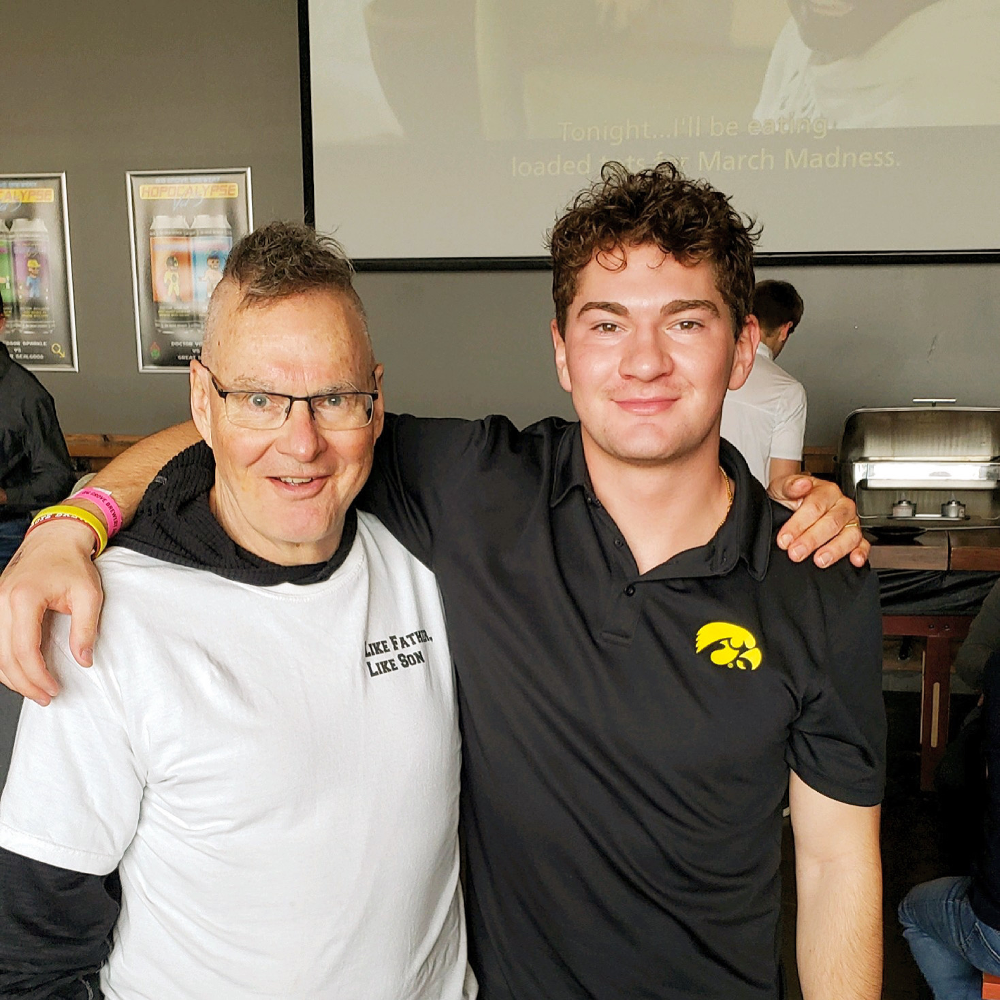

# Homework 6
> This website gives some pictures of me, my dad and I, and a comparison of my friend and I
> Live demo [_here_](file:///Users/ashertitus/Documents/GitHub/ajtitus_HW6/Untitled/index.html). <!-- If you have the project hosted somewhere, include the link here. -->

## Table of Contents
* [General Info](#general-information)
* [Technologies Used](#technologies-used)
* [Features](#features)
* [Screenshots](#screenshots)
* [Setup](#setup)
* [Usage](#usage)
* [Project Status](#project-status)
* [Room for Improvement](#room-for-improvement)
* [Acknowledgements](#acknowledgements)
* [Contact](#contact)
<!-- * [License](#license) -->

## General Information
- This project is a site with pictures of my dad and I. Also, a list of my favorite foods and sports.
- I created this for an assignment in one of my data analytics calsses
- I created this to get a simple understanding of code building and website creation.
<!-- You don't have to answer all the questions - just the ones relevant to your project. -->

## Technologies Used
- GitHub Desktop
- HTML

## Features
- The tabs allow the viewer to find the second page.
- The viewer can go back and forth in between the two pages.

## Screenshots

## Project Status
Project is: Complete

## Room for Improvement
I could increase the amount of information and pictures that are related to me. Also including more tabs with more information or social media platforms as well.

## Acknowledgements
- This project was inspired by Professor Mike Colbert.
- This project was based on an example given in class.

## Contact
Created by [@AsherTitus](https://github.com/AsherTitus) - feel free to contact me!

<!-- Optional -->
<!-- ## License -->
<!-- This project is open source and available under the [... License](). -->

<!-- You don't have to include all sections - just the one's relevant to your project -->
